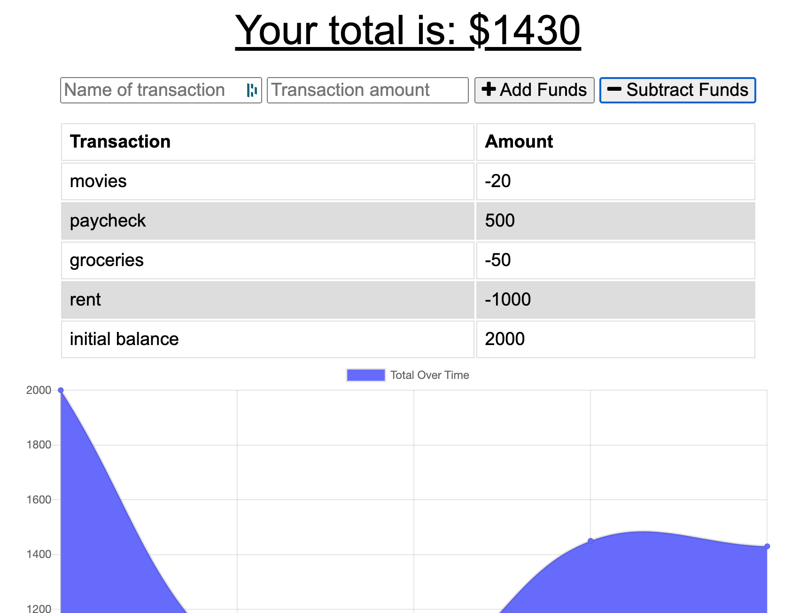

# Online - Offline Budget Tracker

## Table of Contents

1. [Description](#description)

2. [Installation](#installation)

3. [Usage](#usage)

4. [How to contribute](#contribute)

5. [How to run tests](#tests)

6. [License](#license)

7. [Questions](#questions)

## Description

This application allows the user to keep track of expenses and earnings whether they are currently online or not. The app has a simple form to enter spending or income transactions. These are added or subtracted from the total and reflected on the graph for the user to see. If the user is offline, the transactions are stored on the IndexedDB so that they can be added to the regular database once the internet connection is established again.

Deployed Link: https://obscure-thicket-21686.herokuapp.com/

Visual of the app:

## Installation
    
You can use the deployed app (see the link above), or you can clone the repo, install node and all dependencies, and run mongo DB to use it locally.

## Usage
    
On the deployed version you can go to the app, and use the form to enter a transaction and a dollar amount. For example, you might spend $10 on lunch. Then click the button to subtract the amount from the budget. This will decrease your total by $10 and the transaction will be reflected on the graphs. You can also use your browser dev tools to test the functionality while offline.

## How to contribute
    
Please contact me before making any changes

## How to run tests
    
No tests at this time

## License
  
MIT License

        Copyright (c) 2021 Cristina Gorrino
        
        Permission is hereby granted, free of charge, to any person obtaining a copy
        of this software and associated documentation files (the "Software"), to deal
        in the Software without restriction, including without limitation the rights
        to use, copy, modify, merge, publish, distribute, sublicense, and/or sell
        copies of the Software, and to permit persons to whom the Software is
        furnished to do so, subject to the following conditions:
        
        The above copyright notice and this permission notice shall be included in all
        copies or substantial portions of the Software.
        
        THE SOFTWARE IS PROVIDED "AS IS", WITHOUT WARRANTY OF ANY KIND, EXPRESS OR
        IMPLIED, INCLUDING BUT NOT LIMITED TO THE WARRANTIES OF MERCHANTABILITY,
        FITNESS FOR A PARTICULAR PURPOSE AND NONINFRINGEMENT. IN NO EVENT SHALL THE
        AUTHORS OR COPYRIGHT HOLDERS BE LIABLE FOR ANY CLAIM, DAMAGES OR OTHER
        LIABILITY, WHETHER IN AN ACTION OF CONTRACT, TORT OR OTHERWISE, ARISING FROM,
        OUT OF OR IN CONNECTION WITH THE SOFTWARE OR THE USE OR OTHER DEALINGS IN THE
        SOFTWARE.

## Questions

Contact me via email at cgorrino03@gmail.com or through my GitHub [profile](https://github.com/cristina-gorrino). 
    
